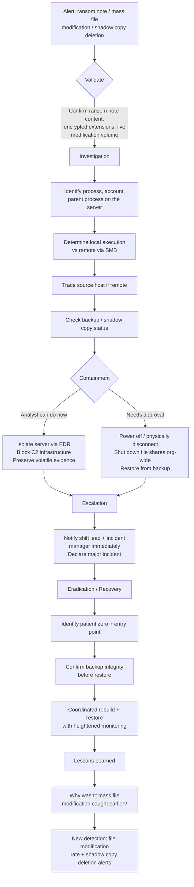

# Playbook 1 · Ransomware on a Critical Server

[⬅ Back to Scenarios](README.md) · [Back to README](../README.md) · [Next: M365 Account Compromise ➡](02-m365-account-compromise.md)

## Flowchart

## Initial alert or situation

A file server shows a ransom note dropped in multiple directories, alongside mass file renaming or modification with a new file extension appearing across shared folders. This may arrive as an EDR alert, a user report of inaccessible files, or a SIEM correlation on abnormal file-write volume.

## Investigation steps, in order

1. **Confirm it is real and live.** Check the ransom note content, the new file extensions being applied, and whether the modification rate is still actively climbing right now.
2. **Identify the responsible process** on the server: process name, parent process, full command line, and the account context it is running under.
3. **Determine the propagation path** — is encryption happening locally on the server, or is it being driven remotely over SMB from another host? Check share access and session logs to find the source if remote.
4. **Trace back to patient zero** if the source is a different host — how did that host get compromised, and when.
5. **Check backup and shadow copy status immediately and independently** — has `vssadmin`, `wmic shadowcopy delete`, or an equivalent already run, and is the backup infrastructure itself reachable and unaffected from the compromised path.
6. **Check for data staging or exfiltration** before encryption — many modern ransomware operations steal data first, so check outbound transfers in the hours before the note appeared.

## Evidence and log sources to review

File server security logs (object and share access events), EDR process and file-modification telemetry, backup system logs and connectivity status, SMB session records, firewall/proxy logs for outbound transfer prior to encryption, and domain controller logs if credential compromise is suspected as the entry vector.

## Severity and business impact reasoning

**Critical, immediately, without waiting for full scope.** Active encryption of shared data threatens availability and integrity for every user and system depending on that share, and every minute of delay is measurably more data lost. If shadow copies or backups have been targeted, the business impact escalates further because the easy recovery path may already be gone.

## Containment actions — analyst vs approval required

| I can do immediately as L2 | Requires approval / escalation |
|---|---|
| Isolate the affected server at the EDR/network level per standing procedure | Powering off or physically disconnecting the server |
| Block confirmed C2 infrastructure per pre-approved threat blocking | Shutting down file shares organisation-wide |
| Preserve volatile evidence and EDR snapshots before further action | Restoring from backup or beginning a rebuild |
| Sweep for the same indicators on other hosts | Declaring a major incident to executives (recommend it; incident manager declares it) |

## Escalation and communication

Escalate immediately and in parallel with initial containment — do not wait for a complete picture. State plainly: what is confirmed, what is contained so far, and what is still unknown. Ransomware on shared infrastructure meets the bar for waking senior management regardless of the hour. Do not speculate about the ransomware family or entry point until there is evidence.

## Recovery, lessons learned, detection improvement

**Recovery** is coordinated with IT: confirm backup integrity independently before restoring (a backup that is itself encrypted or tampered with is a real risk), close the confirmed entry point before reconnecting anything, and monitor the rebuilt environment closely for a defined period before declaring the incident closed.

**Lessons learned** should focus on why mass file modification wasn't caught before a ransom note appeared — that gap, not the ransomware itself, is usually the real finding.

**Detection improvement:** a high-fidelity alert on file-modification rate per account per minute on file servers, and a standing, maximum-priority alert on shadow copy deletion commands and security-tooling disablement — both have almost no legitimate business justification and are two of the highest-value ransomware precursor detections a SOC can build.

## Say this aloud to the interviewer

> "With ransomware on a critical server, speed of containment matters more than completeness of investigation at first — I would isolate the server immediately while checking whether it's spreading via SMB from another host, and independently verify backup and shadow copy integrity right away, because that determines whether recovery is even straightforward. I'd escalate in parallel with containment, not after it, and the real lessons-learned question is always why the earlier-stage precursor behaviour — like shadow copy deletion — wasn't caught before the ransom note ever appeared."

---

[⬅ Back to Scenarios](README.md) · [Back to README](../README.md) · [Next: M365 Account Compromise ➡](02-m365-account-compromise.md)
