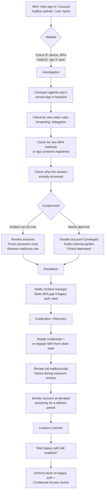

# Playbook 2 · Microsoft 365 Account Compromise

[⬅ Previous: Ransomware](01-ransomware-critical-server.md) · [Back to Scenarios](README.md) · [Back to README](../README.md) · [Next: MFA Fatigue ➡](03-mfa-fatigue-attack.md)

## Flowchart

## Initial alert or situation

Entra ID Identity Protection or a SIEM correlation flags a risky sign-in for a user, or the user themselves reports unusual mailbox behaviour — missing emails, colleagues receiving strange messages, or a sign-in notification they don't recognise.

## Investigation steps, in order

1. **Identify the specific risk signal** that triggered — anonymous IP, unfamiliar sign-in properties, leaked credentials, password spray — since each implies a different next step.
2. **Review the sign-in details**: source IP and reputation, geolocation, device, client app, and whether it was interactive or a background token refresh.
3. **Check exactly how MFA was satisfied** — a legitimate push approval is very different from success via a legacy protocol that never prompted for MFA at all.
4. **Compare against the account's normal baseline** — usual countries, devices, and hours.
5. **Check post-sign-in activity** for persistence: new inbox rules or forwarding, newly registered MFA methods or devices, new OAuth app consents, and mailbox delegation changes.
6. **Determine what the session actually did** — mail read or sent, files accessed, any administrative action if the account is privileged.

## Evidence and log sources to review

Entra ID interactive and non-interactive sign-in logs, Identity Protection risk detections, directory audit logs for mailbox rule and consent changes, mailbox audit logs, device compliance data, and the user's historical sign-in baseline.

## Severity and business impact reasoning

Starts Medium and escalates to High or Critical based on: privileged account involvement, MFA bypassed via legacy authentication, confirmed persistence artefacts (inbox rules, new MFA methods), and evidence the attacker actually accessed or acted on sensitive content.

## Containment actions — analyst vs approval required

| I can do immediately as L2 | Requires approval / escalation |
|---|---|
| Revoke active sessions per standing procedure | Disabling the account, especially if privileged or a VIP |
| Force password reset and MFA re-registration | Notifying external parties who received fraudulent messages |
| Remove a malicious inbox rule after preserving it as evidence | Broad Conditional Access or tenant policy changes |
| Confirm with the user via a verified out-of-band channel | |

## Escalation and communication

Escalate confirmed compromises with the specific evidence: which risk signal fired, how MFA was or wasn't satisfied, and what persistence was found. State plainly whether legacy authentication enabled the bypass — that is usually the actionable root cause for leadership to act on.

## Recovery, lessons learned, detection improvement

**Recovery:** sessions revoked, credentials rotated, all MFA methods re-registered from a verified clean state, mailbox and delegation settings reviewed in full, and elevated monitoring on the account for a defined period afterward.

**Lessons learned:** was legacy authentication still enabled for this user, and why did existing policy not force modern authentication.

**Detection improvement:** enforce Conditional Access blocking legacy authentication entirely, and correlate sign-in risk with user risk to drive automatic session revocation for high-confidence detections rather than waiting for manual triage.

## Say this aloud to the interviewer

> "For an M365 account compromise, I focus on three things fast: how MFA was actually satisfied — because legacy authentication bypassing MFA entirely is the most common real root cause — what persistence the attacker left behind like inbox rules or a new MFA method, and what the session actually touched. I'd revoke sessions and reset credentials immediately, but I wouldn't consider it closed until I've confirmed no attacker-registered MFA method survives the reset, because that's exactly how attackers keep access after a password change."

---

[⬅ Previous: Ransomware](01-ransomware-critical-server.md) · [Back to Scenarios](README.md) · [Back to README](../README.md) · [Next: MFA Fatigue ➡](03-mfa-fatigue-attack.md)
