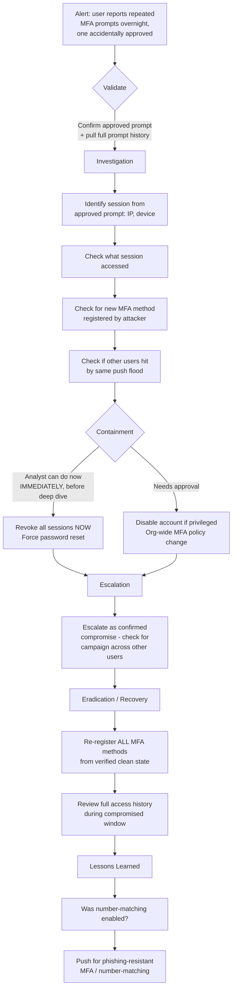

# Playbook 3 · MFA-Fatigue Attack

[⬅ Previous: M365 Compromise](02-m365-account-compromise.md) · [Back to Scenarios](README.md) · [Back to README](../README.md) · [Next: Phishing/BEC ➡](04-phishing-bec-executive.md)

## Flowchart

## Initial alert or situation

A user reports receiving dozens of unsolicited MFA push notifications overnight, and admits they tapped "Approve" once, by accident, just to make the notifications stop.

## Investigation steps, in order

1. **Revoke sessions and force re-authentication immediately** — this is the one containment step in this whole repository that comes *before* investigation, because every minute the attacker holds the approved session is a minute of live access.
2. **Pull the full MFA prompt history overnight**: count, source IP for each attempt, and the exact timestamp of the one that was approved.
3. **Identify what the approved session accessed** — applications, mailbox, files, and any administrative actions if the account is privileged.
4. **Check whether the attacker registered a new MFA method or device** during or immediately after the approved session — this is the single most important check, since it is exactly how attackers survive a password reset.
5. **Check whether other users received similar unsolicited pushes** around the same time, indicating a broader campaign rather than an isolated target.
6. **Review whether number-matching or additional context is enabled** on the MFA method, since its absence is usually what makes fatigue attacks possible in the first place.

## Evidence and log sources to review

Entra ID sign-in and MFA prompt logs (all prompts, not just the approved one), audit logs for MFA method registration changes, application and mailbox audit logs for the compromised session window, and Conditional Access evaluation logs.

## Severity and business impact reasoning

**Critical, from the first minute.** An approved MFA push during a fatigue attack means the attacker holds valid, MFA-satisfied access right now — treat it exactly like a confirmed account compromise, not a near-miss.

## Containment actions — analyst vs approval required

| I can do immediately as L2 | Requires approval / escalation |
|---|---|
| Revoke all active sessions immediately | Disabling the account, if privileged or a VIP |
| Force password reset and full MFA re-registration | Organisation-wide MFA policy changes (number-matching enforcement) |
| Remove any attacker-registered MFA method after evidence capture | |

## Escalation and communication

Escalate immediately as a confirmed compromise. Recommend an organisation-wide check for similar overnight push patterns on other accounts, since fatigue attacks are frequently run against several users at once as part of one campaign.

## Recovery, lessons learned, detection improvement

**Recovery:** credentials rotated, all MFA methods re-registered from a verified clean state, full session and access history reviewed.

**Lessons learned:** was number-matching enabled, and were push notifications rate-limited at all.

**Detection improvement:** alert on high-volume MFA prompts to a single user in a short window regardless of outcome, and push for number-matching or phishing-resistant MFA (FIDO2 keys, certificate-based authentication) as the structural fix — fatigue attacks specifically exploit simple push-approve MFA and nothing else.

## Say this aloud to the interviewer

> "The moment the user tells me they approved one, I treat this as an active compromise happening right now, not a near-miss — so session revocation comes before any deep investigation. Then the most important single check is whether the attacker registered their own MFA method during that window, because a password reset alone does nothing about that — they'd just log back in with their own registered method."

---

[⬅ Previous: M365 Compromise](02-m365-account-compromise.md) · [Back to Scenarios](README.md) · [Back to README](../README.md) · [Next: Phishing/BEC ➡](04-phishing-bec-executive.md)
