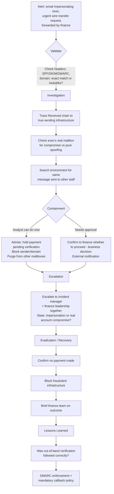

# Playbook 4 · Phishing / BEC Targeting an Executive

[⬅ Previous: MFA Fatigue](03-mfa-fatigue-attack.md) · [Back to Scenarios](README.md) · [Back to README](../README.md) · [Next: Suspicious PowerShell ➡](05-suspicious-powershell-execution.md)

## Flowchart

## Initial alert or situation

An email appearing to come from the CEO asks a finance manager to urgently process a wire transfer to a new supplier account, marked confidential and time-sensitive. The finance manager, suspicious, forwards it to the SOC before acting rather than processing the payment.

## Investigation steps, in order

1. **Check envelope sender, display name, and reply-to** for mismatches against the CEO's genuine address.
2. **Trace the header chain** to identify the true sending infrastructure and compare it against the organisation's legitimate mail sources.
3. **Check SPF, DKIM and DMARC results** — a spoofed exact address usually fails these, though a lookalike domain can pass them legitimately while still being fraudulent.
4. **Check whether the domain is an exact match or a lookalike** (character substitution, extra letter, different top-level domain).
5. **Advise immediately, in parallel with the technical check**, that the payment must not be processed until verified out-of-band — never by replying to the email.
6. **Search the mail environment** for the same or similar messages sent to other staff, since BEC campaigns frequently target several people at once.
7. **Check the CEO's actual account** for any sign-in anomaly, to rule out real account compromise rather than pure impersonation.

## Evidence and log sources to review

Email headers and authentication results, sender domain registration and reputation, the CEO's real mailbox sign-in logs, and a mail-environment-wide search for related messages.

## Severity and business impact reasoning

**High immediately**, given direct financial fraud risk and impersonation of leadership. Escalates further if the CEO's real account is found to be compromised rather than merely spoofed, since that account can reach much more than one fraudulent email.

## Containment actions — analyst vs approval required

| I can do immediately as L2 | Requires approval / escalation |
|---|---|
| Advise finance to hold the payment pending verification | Confirming to finance whether to proceed — a business decision made with the facts I provide |
| Block the sending domain/address per procedure | Contacting the CEO directly about impersonation |
| Search for and quarantine the same message elsewhere | External notification to the supposed new supplier |
| Check the CEO's real account for compromise indicators | |

## Escalation and communication

Escalate immediately to the incident manager and finance leadership together — this is a race against time to prevent fraud. State clearly and immediately whether this is impersonation (spoofed/lookalike domain, real account untouched) or actual account compromise, since the two demand very different responses.

## Recovery, lessons learned, detection improvement

**Recovery:** confirm no payment was made, block the fraudulent infrastructure, brief the finance team on the outcome.

**Lessons learned:** did finance have a defined out-of-band verification step for payment changes, and did they follow it correctly this time — in this scenario, they did, which is exactly the behaviour worth reinforcing.

**Detection improvement:** DMARC enforcement to reduce exact-domain spoofing, an external-sender banner flagging emails claiming to be from internal executives, and a mandatory callback-verification policy for any payment detail change, regardless of how urgently the request arrives.

## Say this aloud to the interviewer

> "Every marker here is classic BEC — executive impersonation, urgency, confidentiality, a new payment destination. The first thing I'd say to the finance manager is that they did exactly the right thing by not acting and forwarding it instead. Then I'd verify authenticity technically through the headers while making sure, in parallel, that no payment gets processed until it's verified through a separate channel — never by replying to the email itself, since that just reaches the attacker directly."

---

[⬅ Previous: MFA Fatigue](03-mfa-fatigue-attack.md) · [Back to Scenarios](README.md) · [Back to README](../README.md) · [Next: Suspicious PowerShell ➡](05-suspicious-powershell-execution.md)
