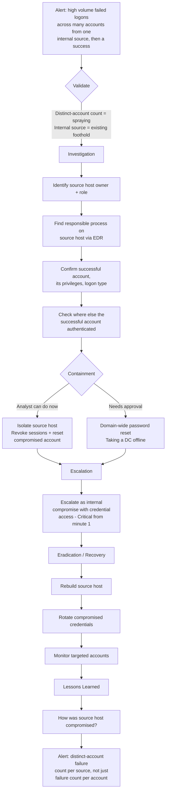

# Playbook 6 · Brute Force Followed by Successful Login

[⬅ Previous: Suspicious PowerShell](05-suspicious-powershell-execution.md) · [Back to Scenarios](README.md) · [Back to README](../README.md) · [Next: Impossible Travel ➡](07-impossible-travel-signin.md)

## Flowchart

## Initial alert or situation

A domain controller shows 400 failed logons for different usernames from one **internal** IP within ten minutes, followed by one successful logon.

## Investigation steps, in order

1. **Recognise the pattern correctly first**: many usernames from one source is password *spraying*, not brute force, and the correct detection signal is the count of distinct accounts targeted, not the count of failures per account.
2. **Identify the source host** from the IP — asset inventory, DHCP records, workstation name — and determine its owner and role.
3. **On the source host, identify the responsible process** via EDR: process name, parent process, full command line, and the account context it ran under.
4. **Determine how the source host was compromised** — first suspicious process, recent downloads, email, or a prior alert on the same machine.
5. **Confirm the successful account**: which account, what privileges it holds, what logon type, and what it did immediately after authenticating.
6. **Check whether the successful account authenticated anywhere else**, and whether the attacker has already moved to a second host.
7. **Check for follow-on activity**: service creation, scheduled tasks, share access, or privilege changes.

## Evidence and log sources to review

Domain controller security logs (4625, 4768, 4771 grouped by source), 4624 for the success with its logon type, EDR process and network telemetry on the source host, directory enumeration activity, the successful account's subsequent authentications and share access, and DHCP/asset inventory.

## Severity and business impact reasoning

**Critical.** Internal password spraying means an existing foothold is already active on the network, and a successful authentication confirms live credential compromise. If the successful account is privileged, this can progress to domain compromise quickly.

## Containment actions — analyst vs approval required

| I can do immediately as L2 | Requires approval / escalation |
|---|---|
| Isolate the source host via EDR | Disabling a privileged or service account |
| Revoke sessions and force password reset on the compromised account | Domain-wide password reset |
| Preserve volatile evidence on the source host | Taking a domain controller offline |
| Sweep for the same behaviour from other sources | |

## Escalation and communication

Escalate immediately as a suspected internal compromise with confirmed credential access. Notify the identity/Active Directory team so they watch for privilege changes. State clearly which account succeeded and what it can access — that drives urgency for management.

## Recovery, lessons learned, detection improvement

**Recovery:** rebuild the source host, rotate the compromised credentials, verify no persistence was established, and monitor the targeted accounts for a defined period.

**Lessons learned:** how did the source host get compromised, and why did internal spraying reach 400 attempts before anyone acted.

**Detection improvement:** alert on a single source producing failed authentications against a high count of **distinct accounts** within a short window — that is the correct signal for spraying — and alert on any success immediately following a source that has just sprayed.

## Say this aloud to the interviewer

> "Many usernames from one internal source is spraying, not brute force, and internal means something is already compromised on our network to be doing this. I'd work three things at once — contain the source host, contain the account that succeeded, and map exactly what that account can reach — and escalate immediately, because that success makes this a live, active compromise from the first minute."

---

[⬅ Previous: Suspicious PowerShell](05-suspicious-powershell-execution.md) · [Back to Scenarios](README.md) · [Back to README](../README.md) · [Next: Impossible Travel ➡](07-impossible-travel-signin.md)
