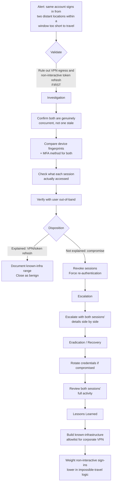

# Playbook 7 · Impossible-Travel / Cloud Sign-In Alert

[⬅ Previous: Brute Force → Success](06-bruteforce-then-success.md) · [Back to Scenarios](README.md) · [Back to README](../README.md) · [Next: Malware on Privileged Workstation ➡](08-malware-privileged-workstation.md)

## Flowchart

## Initial alert or situation

A sign-in appears from one country at 09:00 and from a different, distant country at 09:20 for the same user — physically implausible travel time.

## Investigation steps, in order

1. **Rule out the two most common legitimate explanations first**, before treating this as compromise: a corporate VPN or proxy exiting in a different country than the user's real location, and a non-interactive token refresh rather than a fresh interactive logon.
2. **Confirm both sign-ins are genuinely concurrent**, not one stale session still showing as active after an unclean disconnect.
3. **Compare device identifiers and client/browser fingerprints** between the two sign-ins.
4. **Check MFA satisfaction and method** for both.
5. **Check what each session actually did** — mailbox access, file access, application usage.
6. **Attempt to reach the user through a verified out-of-band channel** to confirm their actual location, once the above checks warrant it.
7. **Check the account's history** for whether this exact pattern is a known, already-explained recurrence (e.g., a specific VPN client behaviour).

## Evidence and log sources to review

Entra ID sign-in logs including the interactive/non-interactive flag, IP address and known infrastructure ranges, device and client details, MFA logs, and Conditional Access evaluation results for both sign-ins.

## Severity and business impact reasoning

**High until explained.** Impossible travel that survives the VPN and token-refresh checks strongly indicates the credential is genuinely in two places at once, which is compromise by definition.

## Containment actions — analyst vs approval required

| I can do immediately as L2 | Requires approval / escalation |
|---|---|
| Revoke sessions for the account pending confirmation | Disabling the account before confirming with the user |
| Force re-authentication with MFA | Broad geographic blocking |
| Preserve both sessions' activity logs | |

## Escalation and communication

If confirmed compromise, escalate with both session details side by side. If explained by VPN infrastructure, document the corporate egress ranges so future alerts on the same pattern are triaged in seconds rather than re-investigated from scratch.

## Recovery, lessons learned, detection improvement

**Recovery:** session revocation and credential rotation if compromised.

**Lessons learned:** if VPN egress caused repeated false impossible-travel alerts, that is a genuine tuning opportunity, not something to just keep manually re-checking.

**Detection improvement:** maintain a known-infrastructure allowlist for corporate VPN/proxy egress ranges so Identity Protection's location logic does not misfire on legitimate traffic, and weight non-interactive sign-ins lower in the impossible-travel logic since they commonly produce false apparent geography shifts.

## Say this aloud to the interviewer

> "Twenty minutes isn't enough time to travel between most countries, so on the surface it looks impossible — but before I call it a compromise, I check for corporate VPN egress and non-interactive token refresh first, since both commonly produce this exact pattern legitimately. If neither explains it and the devices genuinely differ, I treat it as compromise and revoke sessions immediately."

---

[⬅ Previous: Brute Force → Success](06-bruteforce-then-success.md) · [Back to Scenarios](README.md) · [Back to README](../README.md) · [Next: Malware on Privileged Workstation ➡](08-malware-privileged-workstation.md)
