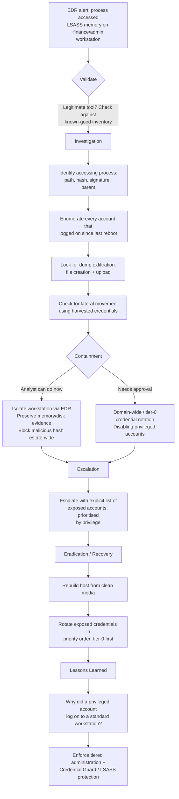

# Playbook 8 · Malware / EDR Alert on a Privileged Workstation

[⬅ Previous: Impossible Travel](07-impossible-travel-signin.md) · [Back to Scenarios](README.md) · [Back to README](../README.md) · [Next: Suspected Lateral Movement ➡](09-suspected-lateral-movement.md)

## Flowchart

## Initial alert or situation

EDR raises an alert that a process accessed LSASS memory on a finance workstation, with a suspicious access mask from a non-standard process.

## Investigation steps, in order

1. **Identify the accessing process** in full: path, hash, digital signature, parent process, command line, and the account it ran as.
2. **Determine whether it is a legitimate tool first** — some security and backup products access LSASS legitimately, so confirm against the known-good inventory rather than assuming malice.
3. **Establish how the process got on the host and when it first appeared**, which points to the initial access.
4. **Enumerate every account that logged on to this host since its last reboot** — this defines exactly what credentials could have been in LSASS memory, and it is the single most important step, because the impact spreads far beyond this one machine.
5. **Look for exfiltration of the dump** — a large dump file creation, followed by an upload, SMB copy, or archiving.
6. **Check for lateral movement already using the harvested credentials** — unusual logons by those accounts elsewhere in the estate.
7. **Sweep the estate** for the same process hash and the same behaviour on other hosts.

## Evidence and log sources to review

EDR process access telemetry (Sysmon Event ID 10 where deployed, with the LSASS target and access mask), process creation events with command lines, file creation events for dump files, 4624 history on the host, network telemetry for upload, and an estate-wide indicator sweep.

## Severity and business impact reasoning

**Critical if any privileged account logged on to the host; High otherwise.** The impact is not the host — it is every credential cached on that machine, which makes this a lateral-movement enabler rather than a single-host problem.

## Containment actions — analyst vs approval required

| I can do immediately as L2 | Requires approval / escalation |
|---|---|
| Isolate the workstation via EDR | Domain-wide or tier-0 credential rotation |
| Preserve memory and disk evidence before changes | Reimaging before evidence collection completes |
| Block the malicious binary hash across the estate | Disabling privileged accounts still in use |
| Sweep for the same indicators elsewhere | |

## Escalation and communication

Escalate immediately with an **explicit list of exposed accounts, prioritised by privilege** — that list is the single most useful thing you can hand the incident manager, because it defines the credential rotation scope directly.

## Recovery, lessons learned, detection improvement

**Recovery:** rebuild the host from clean media, rotate exposed credentials in priority order (tier-0/domain admin first, then service accounts, then standard users), and monitor affected accounts closely for a defined period.

**Lessons learned:** why did a privileged account log on to a standard workstation in the first place.

**Detection improvement:** enable LSASS protected process and Credential Guard where supported, enforce tiered administration so administrators never log on to workstations, and alert on any non-allowlisted process opening a handle to LSASS.

## Say this aloud to the interviewer

> "LSASS access means credential dumping until proven otherwise, and the key insight is that the impact isn't limited to this one machine — every account that logged on since the last reboot is now a potentially compromised credential. So I isolate and preserve evidence, then immediately produce the list of exposed accounts by privilege, because that's what actually defines the rotation scope for the incident manager."

---

[⬅ Previous: Impossible Travel](07-impossible-travel-signin.md) · [Back to Scenarios](README.md) · [Back to README](../README.md) · [Next: Suspected Lateral Movement ➡](09-suspected-lateral-movement.md)
