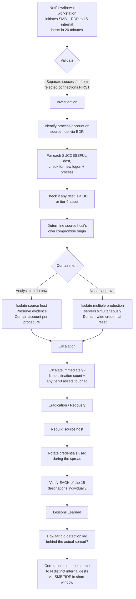

# Playbook 9 · Suspected Lateral Movement

[⬅ Previous: Malware on Privileged Workstation](08-malware-privileged-workstation.md) · [Back to Scenarios](README.md) · [Back to README](../README.md) · [Next: Data Exfiltration ➡](10-data-exfiltration-alert.md)

## Flowchart

## Initial alert or situation

Firewall and NetFlow logs show one internal workstation initiating SMB and RDP connections to fifteen other internal hosts within twenty minutes.

## Investigation steps, in order

1. **Separate successful from rejected connections in the flow data first** — a high rejection rate suggests scanning; a high success rate suggests active lateral movement already occurring, and this single distinction changes everything about urgency.
2. **On the source host, identify the responsible process**, its parent, command line, and the account context via EDR telemetry.
3. **Check whether the account driving these connections is the logged-on user or a different, higher-privileged account** — a strong pointer to credential theft.
4. **For each destination with a successful connection**, check for a new logon (4624 type 3 or 10) around the same timestamp and any subsequent process creation.
5. **Check whether any destination is a domain controller or another tier-0 asset**, which changes severity immediately.
6. **Determine how the source host was itself compromised** — the true origin of the spread.
7. **Check whether this pattern is now repeating from any of the fifteen destinations**, confirming active propagation.

## Evidence and log sources to review

Firewall/NetFlow connection records with success/reject state, EDR process and network telemetry on the source host, security event logs (4624, 4688) on each destination, asset inventory for destination criticality, and directory logs for the account used.

## Severity and business impact reasoning

**Critical if any connection succeeded**, especially to a server or domain controller — this is active lateral movement with potential for rapid, wide compromise. **High even if all connections were rejected**, since scanning still indicates an active internal threat gathering targets.

## Containment actions — analyst vs approval required

| I can do immediately as L2 | Requires approval / escalation |
|---|---|
| Isolate the source host via EDR | Isolating multiple production servers simultaneously |
| Preserve evidence on the source host | Segmenting a network zone |
| Check and contain the account used, per procedure | Domain-wide credential rotation |
| Check the fifteen destinations for follow-on activity | Taking a domain controller offline |

## Escalation and communication

Escalate immediately as suspected active lateral movement, listing the destination count and which, if any, are tier-0 assets. This is exactly the kind of finding that justifies declaring a major incident before full scope is known — speed of containment matters more than a complete picture here.

## Recovery, lessons learned, detection improvement

**Recovery:** rebuild the source host, rotate any credentials used during the spread, and individually verify each of the fifteen destinations before declaring them clean — do not assume clean based on the source host alone.

**Lessons learned:** how far did detection lag behind the actual spread.

**Detection improvement:** a correlation rule for one source host connecting via SMB or RDP to an unusual number of distinct internal destinations within a short window — this specific pattern is one of the highest-value lateral movement detections a SOC can build.

## Say this aloud to the interviewer

> "Fifteen internal hosts over SMB and RDP in twenty minutes from one workstation is lateral movement or scanning, not normal use, so I'd check which connections actually succeeded first — that single fact drives everything else. I'd find the process and account on the source host, isolate immediately, and check every successful destination for a new logon and follow-on activity, because I have to assume the spread is already live until I can prove otherwise."

---

[⬅ Previous: Malware on Privileged Workstation](08-malware-privileged-workstation.md) · [Back to Scenarios](README.md) · [Back to README](../README.md) · [Next: Data Exfiltration ➡](10-data-exfiltration-alert.md)
