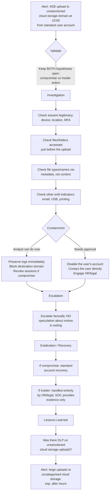

# Playbook 10 · Data-Exfiltration Alert

[⬅ Previous: Suspected Lateral Movement](09-suspected-lateral-movement.md) · [Back to Scenarios](README.md) · [Back to README](../README.md) · [Next: Insider Threat ➡](11-insider-threat-warning.md)

## Flowchart

## Initial alert or situation

A workstation on a standard user's account uploads 4 GB to an external cloud storage domain the company does not officially use, at 23:00.

## Investigation steps, in order

1. **Confirm the transfer details** from proxy/firewall logs: destination domain, total bytes, duration, and whether it was continuous or in bursts.
2. **Check the identity session's legitimacy**: was this the user's normal device, location, and time pattern, and was authentication fully satisfied including MFA.
3. **Check endpoint activity immediately before the upload**: which folders and files were accessed, copied, or compressed, using file access and process telemetry.
4. **Determine file types and naming from metadata** where possible, without opening or exposing sensitive content unnecessarily.
5. **Check whether this pattern is new for this user**, and whether other users show the same pattern to the same destination.
6. **Check for other exfiltration indicators** around the same time — externally sent email attachments, USB device activity, or printing.
7. **Preserve the evidence trail carefully**, since this may become a personnel matter as well as a security one.

## Evidence and log sources to review

Proxy and firewall logs for the transfer, identity sign-in logs for the session, EDR file access and process telemetry, DLP alerts if available, email and removable-media logs for corroborating activity, and HR-relevant context only through the proper channel — never accessed directly by the analyst.

## Severity and business impact reasoning

**High to Critical** depending on data sensitivity, which in a government or high-trust environment should be assumed sensitive until classified otherwise. Confidentiality impact drives severity, and the after-hours timing raises concern regardless of the eventual cause.

## Containment actions — analyst vs approval required

| I can do immediately as L2 | Requires approval / escalation |
|---|---|
| Preserve logs and evidence immediately, before they age out | Disabling the user's account |
| Block the destination domain per standing procedure | Contacting the user directly |
| Revoke active sessions if account compromise is suspected | Engaging HR or legal |
| Document facts precisely and objectively | Any communication framing this as confirmed wrongdoing |

## Escalation and communication

Escalate immediately and factually, with **no speculation about motive in writing**. This is a case where the incident manager, HR, and potentially legal need to be involved, and the decision to contact the user or their manager belongs above the analyst level. Confidentiality of the investigation itself matters — never discussed outside the defined reporting chain.

## Recovery, lessons learned, detection improvement

**Recovery:** if compromise, standard account recovery; if insider action, handled entirely outside the SOC through HR and legal process, with the SOC providing evidence only.

**Lessons learned:** was there a DLP or upload-size control on unsanctioned cloud destinations.

**Detection improvement:** alert on large uploads to uncategorised or unsanctioned cloud storage domains, particularly outside business hours, and consider blocking unsanctioned cloud storage categories at the proxy by policy.

## Say this aloud to the interviewer

> "I'd keep both account compromise and insider action open as hypotheses and let the evidence decide — checking session legitimacy and what was accessed just before the upload. I'd preserve evidence immediately and escalate straight away, but engaging HR or contacting the user directly is a decision above my level, not something I do myself."

---

[⬅ Previous: Suspected Lateral Movement](09-suspected-lateral-movement.md) · [Back to Scenarios](README.md) · [Back to README](../README.md) · [Next: Insider Threat ➡](11-insider-threat-warning.md)
