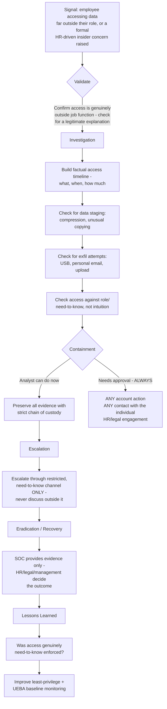

# Playbook 11 · Insider-Threat Warning

[⬅ Previous: Data Exfiltration](10-data-exfiltration-alert.md) · [Back to Scenarios](README.md) · [Back to README](../README.md) · [Next: DDoS / Availability ➡](12-ddos-availability-incident.md)

## Flowchart

## Initial alert or situation

A behavioural or access-pattern signal suggests an employee is accessing data significantly outside what their role requires — this may come from a UEBA alert, a manager's report, or a formal concern raised through HR channels.

## Investigation steps, in order

1. **Confirm the access is genuinely outside the person's job function** — check for a legitimate explanation first: a project reassignment, cross-training, an approved exception, or a role change not yet reflected in access records.
2. **Build a factual, objective access timeline**: what was accessed, when, how much, and whether the pattern is a one-time event or sustained.
3. **Check for data staging behaviour** — compression, unusual bulk copying, or archiving of the accessed data.
4. **Check for exfiltration attempts** specifically — removable media use, personal email, or upload activity correlating with the access.
5. **Check access against documented role and need-to-know**, not against personal intuition about what "seems reasonable."
6. **Preserve every piece of evidence with strict chain of custody**, since this is highly likely to become a formal HR or legal matter regardless of outcome.

## Evidence and log sources to review

File and data access logs, DLP alerts, endpoint activity for staging or exfiltration behaviour, and access/entitlement records — all handled through the organisation's defined restricted-access process for personnel-sensitive investigations, never accessed casually or shared outside the need-to-know group.

## Severity and business impact reasoning

Treat as **High from the outset**, regardless of how the case ultimately resolves — the potential impact of a genuine insider threat in a high-trust environment is severe, and the investigation itself carries real risk if mishandled (to the individual, to the organisation, and to the integrity of the process).

## Containment actions — analyst vs approval required

| I can do immediately as L2 | Requires approval / escalation |
|---|---|
| Preserve all evidence with documented chain of custody | Any account action against the individual |
| Document facts objectively, with zero speculation about motive | Any direct or indirect contact with the individual |
| Escalate through the correct restricted channel | HR and legal engagement — always decided above the analyst level |

## Escalation and communication

Escalate **only** through the organisation's defined restricted, need-to-know reporting channel for personnel-sensitive matters — never through the general SOC channel, never discussed with colleagues outside that specific process, and never speculated about in writing. This is the one scenario in this repository where over-communication is itself a risk, not just under-communication.

## Recovery, lessons learned, detection improvement

**Recovery and outcome** are decided entirely by HR, legal, and management — the SOC's role is to provide accurate, well-preserved evidence, not to determine or communicate the outcome.

**Lessons learned:** was need-to-know access genuinely enforced technically, or was it relying on trust alone.

**Detection improvement:** strengthen least-privilege access controls so the technical boundary matches the policy boundary, and build behavioural baseline monitoring (UEBA) for unusual access patterns relative to role and peer group, so early-stage concerns surface before large-scale data movement occurs.

## Say this aloud to the interviewer

> "This is the one scenario where confidentiality discipline matters as much as the technical investigation itself. I would build a factual, objective access timeline, check it against documented need-to-know rather than my own judgement of what seems reasonable, and preserve every piece of evidence with strict chain of custody — but escalate only through the correct restricted channel, and never take any account action or contact the individual myself, because that decision belongs to HR, legal, and management, not to me."

---

[⬅ Previous: Data Exfiltration](10-data-exfiltration-alert.md) · [Back to Scenarios](README.md) · [Back to README](../README.md) · [Next: DDoS / Availability ➡](12-ddos-availability-incident.md)
