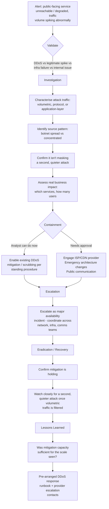

# Playbook 12 · DDoS or Major Availability Incident

[⬅ Previous: Insider Threat](11-insider-threat-warning.md) · [Back to Scenarios](README.md) · [Back to README](../README.md)

## Flowchart

## Initial alert or situation

A public-facing service becomes unreachable or severely degraded, with monitoring showing an abnormal spike in inbound traffic volume.

## Investigation steps, in order

1. **Distinguish DDoS from a legitimate traffic spike, an infrastructure failure, or an internal issue** — check traffic source diversity, request patterns, and whether any recent legitimate change (a marketing push, a viral event) could explain a real spike.
2. **Characterise the attack type**: volumetric (raw bandwidth exhaustion), protocol-based (exploiting weaknesses in network protocols), or application-layer (overwhelming a specific service with seemingly valid requests).
3. **Identify the source pattern** — a widely distributed botnet versus a smaller number of concentrated sources, since this affects the mitigation approach.
4. **Check specifically whether the DDoS could be cover for a second, quieter attack** — DDoS is a known diversion tactic used to draw attention away from a simultaneous intrusion or data theft attempt elsewhere.
5. **Assess the real business impact**: which specific services are affected, how many users, and any dependent systems also impacted.
6. **Check whether existing DDoS mitigation or scrubbing services are engaging automatically**, and whether they are proving effective.

## Evidence and log sources to review

Network flow and volume monitoring, load balancer and web server logs for request patterns, CDN/DDoS mitigation provider dashboards and logs, and — critically — SOC monitoring across *other* systems for any concurrent, unrelated suspicious activity that the DDoS traffic might be masking.

## Severity and business impact reasoning

**Critical** if a primary public-facing or citizen/customer-facing service is down or severely degraded — direct availability impact affects every user of that service simultaneously, and in a government or high-trust context, service availability itself often carries public-facing and reputational significance beyond the technical outage.

## Containment actions — analyst vs approval required

| I can do immediately as L2 | Requires approval / escalation |
|---|---|
| Enable existing DDoS mitigation or scrubbing per standing procedure | Engaging the ISP or CDN provider for emergency mitigation |
| Monitor and report mitigation effectiveness in real time | Emergency architecture or routing changes |
| Continue monitoring other systems for a masking attack | Any public communication about the outage |

## Escalation and communication

Escalate immediately as a major availability incident — this typically requires coordination across network engineering, infrastructure, and communications teams simultaneously, not just the SOC. State clearly: services affected, current mitigation status, and — importantly — whether anything suspicious has been found on other systems that could indicate this is a diversion.

## Recovery, lessons learned, detection improvement

**Recovery:** confirm mitigation is holding and traffic has normalised, and continue watching closely for a second, quieter attack once the volumetric noise is filtered out — this is the single most important recovery-phase check for this incident type specifically.

**Lessons learned:** was existing mitigation capacity sufficient for the scale actually observed, and how quickly did the team recognise and characterise the attack type.

**Detection improvement:** maintain a pre-arranged DDoS response runbook with provider escalation contacts ready in advance, since minutes matter and this is not the moment to be looking up who to call.

## Say this aloud to the interviewer

> "Beyond just restoring the service, the thing I'd stay most alert to during a DDoS is whether it's being used as cover for something quieter happening elsewhere — that's a known tactic, so I'd keep monitoring the rest of the environment closely throughout, not just focus entirely on the outage itself. I'd engage existing mitigation immediately, escalate as a major incident needing network and infrastructure coordination, and only consider it truly resolved once I've confirmed nothing else happened while attention was on the noise."

---

[⬅ Previous: Insider Threat](11-insider-threat-warning.md) · [Back to Scenarios](README.md) · [Back to README](../README.md)
